# Dataset and Share Setup Guide

This guide provides the recommended setup for dataset permissions, shares and application data storage.

## Dataset Permissions

TrueCharts applications are designed to use the `apps` (568) user for data permissions. Configure your dataset permissions as shown below to allows applications access.

:::info ACL

If your existing dataset shows `Edit ACL` then you need to `Strip ACL` before continuing.

:::


## SMB Access

For SMB access you will need to create a user(s) that are members of the `apps` group and modify the default SMB settings. 

### SMB User

Create a user and assign it to the `apps` group under `Auxiliary Groups` as shown below.

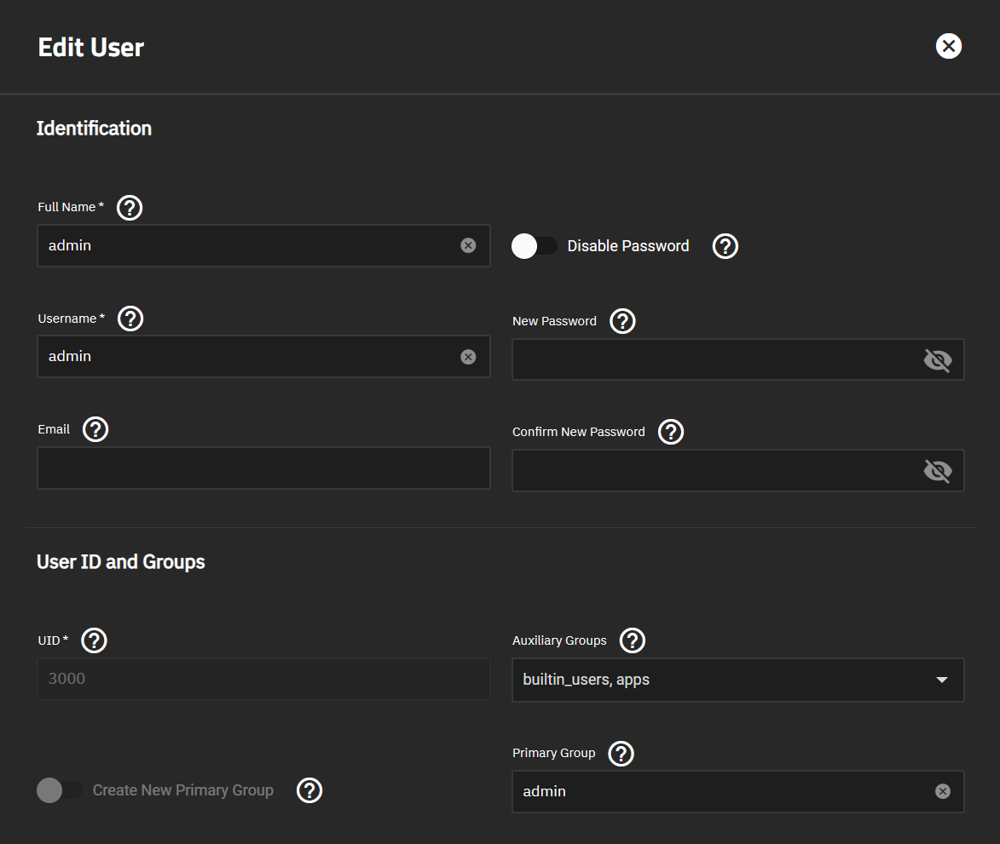

### SMB Share

import Tabs from '@theme/Tabs';
import TabItem from '@theme/TabItem';

<Tabs>
  <TabItem value="bluefin" label="Bluefin" default>
Create an SMB Share as shown below. All settings should remain default except for `Auxiliary Parameters`.

:::warning ACL

After saving SMB settings TrueNAS Scale will launch an `Edit ACL` screen. Do **NOT** `Save Access Control List` as this will overwrite the previously configured permissions. You can make any selection from the TrueNAS GUI to exit this screen, SMB Share will still be configured.

:::

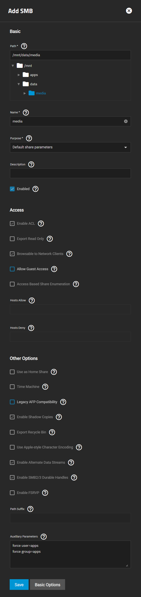

```bash
force user=apps
force group=apps
```
  </TabItem>
  <TabItem value="cobia" label="Cobia">
Create an SMB Share as shown below. All settings should remain default.

:::warning ACL

After saving SMB settings TrueNAS Scale will ask if you want to `Configure ACL`. Do **NOT** as this will overwrite the previously configured permissions. You can select `Cancel`, SMB Share will still be configured.

:::

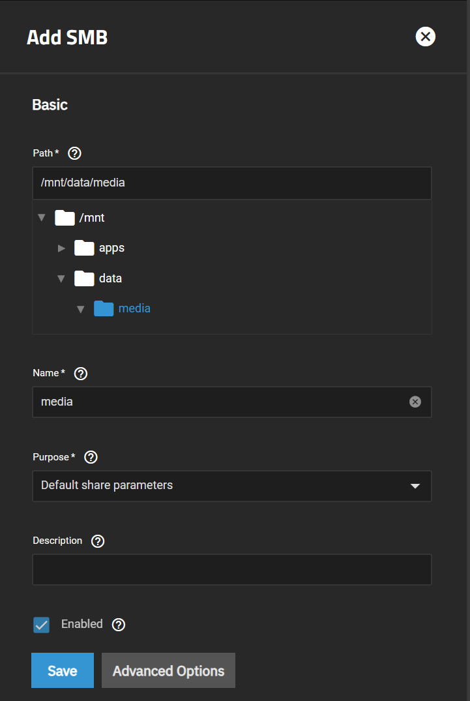

#### Setup SMB Share Auxiliary Parameters

With the release of Cobia the `Auxiliary Parameters` has been removed from the WebUI. The below will guide you through the use of API calls and the system shell to add the correct parameters.

Access the API Documentation using Scale http://IP:PORT/api/docs/ (ie. http://192.168.1.4:81/api/docs/)

Select `RESTful 2.0`

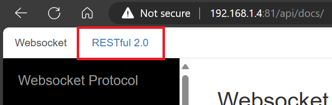

Select `Authorize` and enter login as `root` click close when complete.

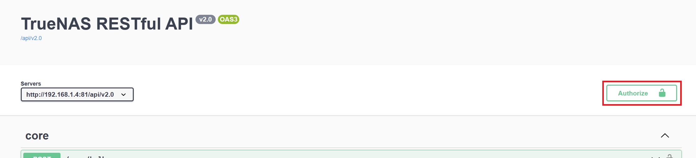

Scroll down to `sharing.smb`

Select the down arrow on `GET /sharing/smb`

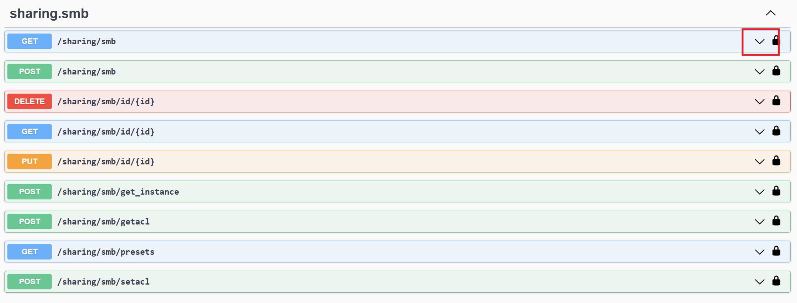

Select `Try it out`

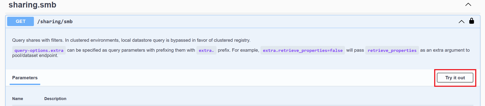

Select `Execute`

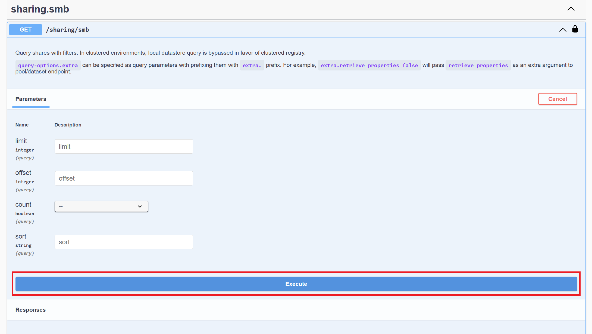

Take note of the response. You are looking for the `id` of the SMB Share you previously created.

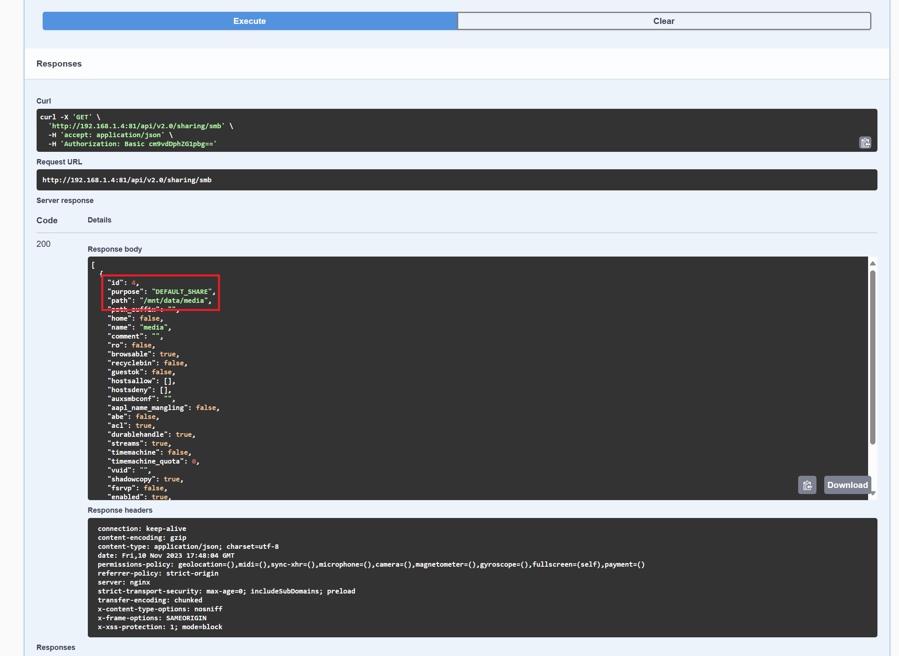

Now select the down arrow on `PUT /sharing/smb/id/{id}`

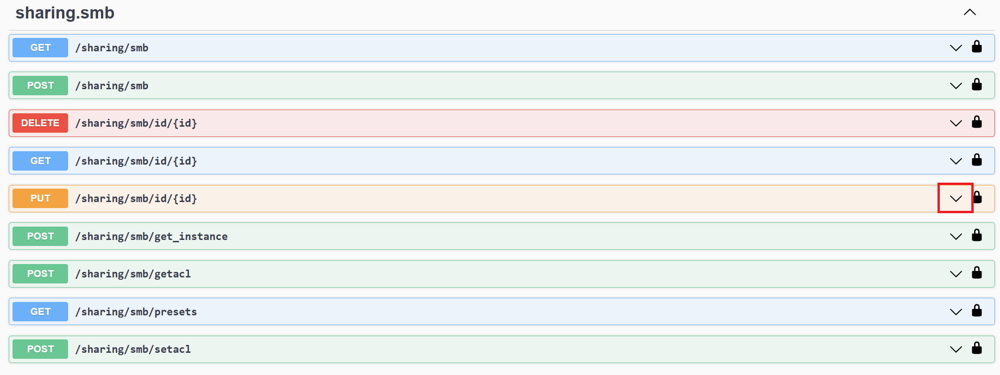

Select `Try it out`

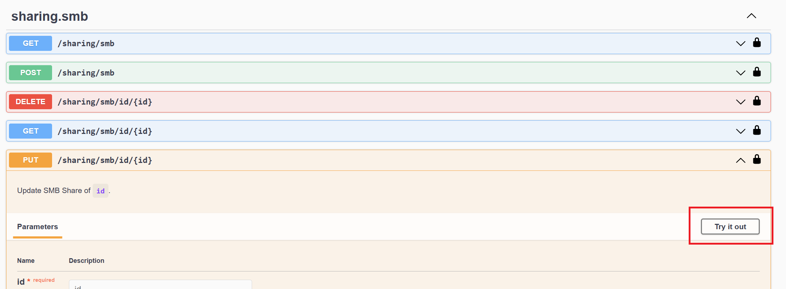

Enter the ID previously identified in the `id` block and select `Execute`.

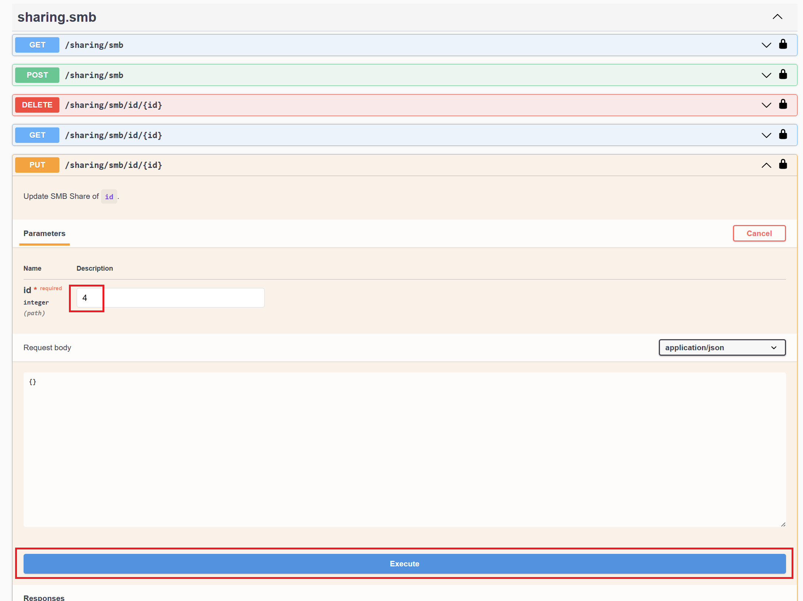

Copy the output of the `Curl` block.

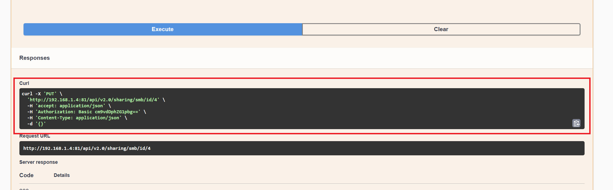

Access the system shell as `root`.

Paste the output from the `Curl` block.

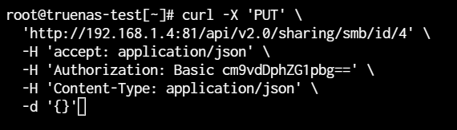

Change the last line with the following input:

```bash
-d '{"auxsmbconf": "force user=apps\nforce group=apps"}'
```

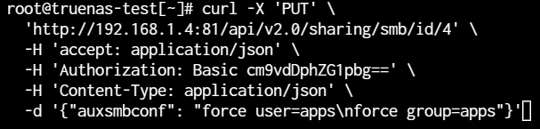

Hit enter and you should see the following output.

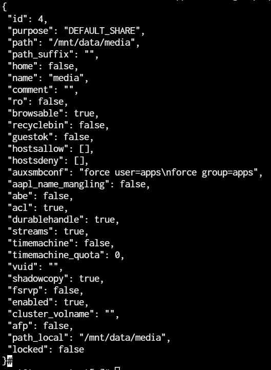

  </TabItem>
</Tabs>

## NFS Share

Create an NFS Share which will be used for applications to access the dataset. Configure an NFS Share as shown below. All settings should remain default.

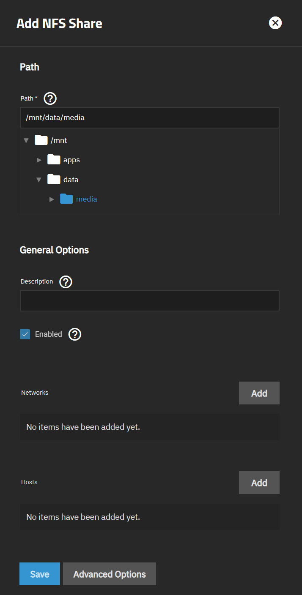

## App Storage

For most applications data access will be configured under `Additional App Storage`.

:::caution APP CONFIG STORAGE

NFS should **NOT** be used for `App Config Storage`. This should be left on the default of PVC.

:::

Configure `Additional App Storage` as shown below. In some applications data storage is part of the application configuration, in those cases you would still configure NFS but not need to setup a `Mount Path`.

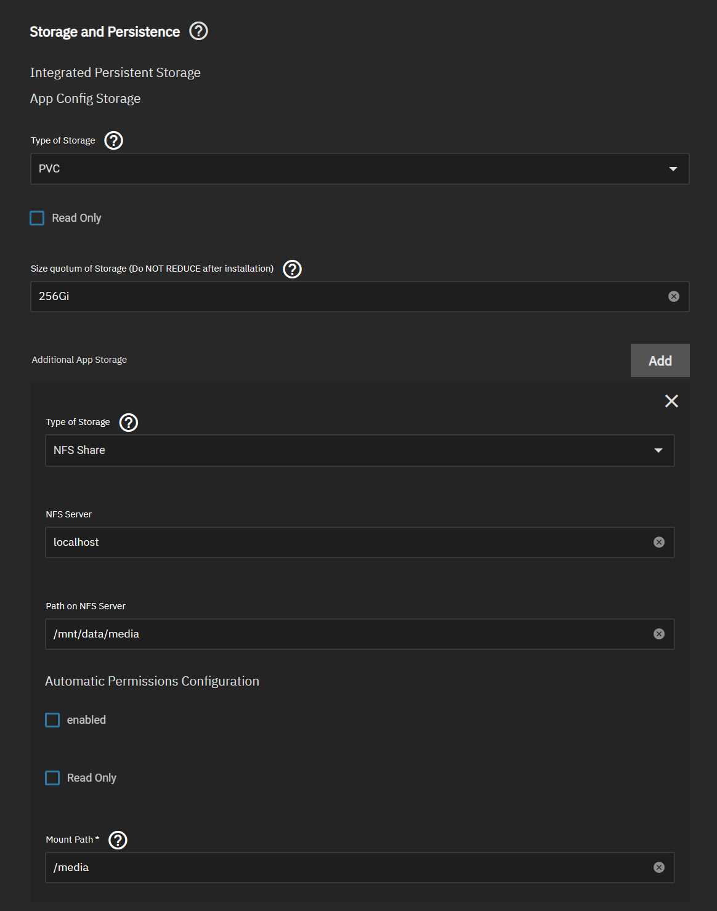

